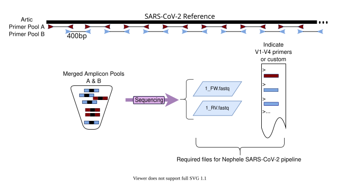
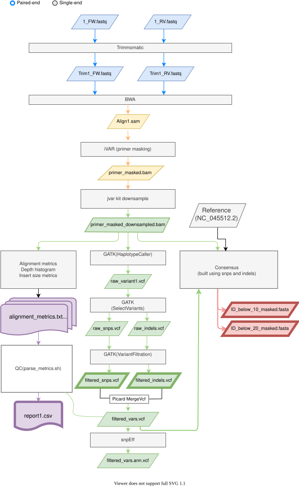

## SARS-CoV-2 User Guide

### ARCTICplus Method

ARTIC protocol uses a multiplexed PCR approach with two primer pools tiling the entire genome. The primer sequences are not trimmed but masked during variant calling.

The pipeline takes as input single end or paired-end fastq files. The primer sequences for the v1-v4 ARTIC protocol are already integrated in the pipeline therefore the user simply needs to indicate which version of primers should the pipeline use. Optionally, the user can import a BED file with the primer scheme (see example in this [BED file](https://github.com/joshquick/artic-ncov2019/blob/master/primer_schemes/nCoV-2019/V4/SARS-CoV-2.scheme.bed)). The pipeline will run as indicated in the diagram shown below to produce metrics files, alignment files (BAM format), alignment coverage diagram and tables with variant calls.

### User Options

- **Nephele QC pipeline**: We recommend running all sample files through Nephele's QC pipeline before running samples in the SARS-CoV-2 pipeline. It is always a good idea to view the quality of your data before analysis

- **Input FASTA/Q files**:
    
    - **ARTICplus method**: The pipeline expects FASTQ files (single or paired) per samples and a simple mapping file to map the sample name with the FASTQ files (see example below).
	    **Example ARTICplus method mapping file:**
    
    
    |#SampleID|ForwardFastqFile|ReverseFastqFile|
    |---|---|---|
    |N1|N1_L001_R1_001.fastq.gz|N1_L001_R2_001.fastq.gz|
    |N2|N2_L001_R1_001.fastq.gz|N2_L001_R1_001.fastq.gz|
    

### Dependencies
- TRIMMOMATIC 0.39
- BWA 0.7.17
- PICARD 2.23.8
- GATK 4.1.9.0
- SAMTOOLS 1.11
- HTSLIB 1.11
- BCFTOOLS 1.11
- DEEPTOOLS 3.5.1
- PILON 1.23
- BEDTOOLS 2.30.0
- PYSAM 0.19.1
- PYPAIRIX 0.3.7
- SNPEFF 5.1
- IVAR 1.3.1 (Only in the ARTICplus method)

### Pipeline Major Steps

- **Trim**: Trims and removes reads based on the following settings:
    
    - ILLUMINACLIP:adapter.fa:2:30:10:8:true Trims reads of adapters.
    
    - ILLUMINACLIP:primer_{A,B}.fa:2:30:10:8:true Trims reads of primers.
    
    - LEADING:20 removes leading bps below quality threshold of 20.
    
    - TRAILING:20 removes trailing bps below quality threshold of 20.
    
    - SLIDINGWINDOW:4:20 trims read at the left most bp when the average quality of 4 bps falls below 20.
    
    - MINLEN:20 removes reads below 20bp in length.
    
- **Align**: Quality trimmed single or paired-end reads are mapped to reference genome Wuhan-Hu-1 (Genbank: NC_045512.2) using bwa mem.

- **Primer Trim**: Primer sequences in BAM alignment file are masked using iVar.

- **Downsample BAM**: BAM alignment file is downsampled using the jvarkit biostar154220.jar downsample tool. A region's coverage is downsampled to 200X coverage if that regions coverage is above 200X.

- **Call Variants**: Variants are called using GATK HaplotypeCaller.

- **Filter Variants**: Raw variant call file is split in to an individual SNP and Indel VCF file using GATK SelectVariants for filtering. The filtered individual files are then merged using Picard tools MergeVcfs to a single filtered variants file.

- **SNP filter thresholds**: QD < 2.0, FS > 100.0, MQ < 40.0, SOR > 4.0, ReadPosRankSum < -8.0

- **Indel filter thresholds**: DP < 20.0, QD < 2.0, FS > 200.0, SOR > 10.0

- **Annotate Variant File**: Variant file is annotated using snpEff.

- **Consensus Generation**: A raw consensus genome is first generated using GATK FastaAlternateReferenceMaker from the merged filtered variants VCF file. Reads are then mapped to the raw consensus sequence to generate a BAM file used for masking regions of the consensus genome where coverage is less than 20X or 20X.

- **QC Metrics**: Produces a report of each sample's total reads, aligned reads, percent reads aligned, average read length, percent of paired reads, number of snps, number of indels, mean coverage, and the percent of the genome that is covered at at least 50X.

### Output Files/Directories
- **`consensus`**
    
    - `sampleID_below_10_masked.fasta`: Consensus sequence with regions below a depth of 10 reads masked
    
    - `sampleID_below_20_masked.fasta`: Consensus sequence with regions below a depth of 20 reads masked
    
- **`metrics`**
    
    - `sampleID_alignment_metrics.txt`: Full report of alignment summary metrics. To learn the meaning of all columns, see [http://broadinstitute.github.io/picard/picard-metric-definitions.html#AlignmentSummaryMetrics](http://broadinstitute.github.io/picard/picard-metric-definitions.html#AlignmentSummaryMetrics).
    
    - `sampleID_coverage_plot.pdf`: Image describing coverage of genome by reads. The coverage gets downsampled to 200x in the lower pane.
    
    - `sampleID_depth_out.txt`: Histogram data of depth along the genome coordinates
    
    - `sampleID_ TX0018_insert_metrics.txt`: Report of the insert size identified using paired data
    
- **`reports`**
    
    - `nephele2_covid19_report.csv`: Report of each sample's total reads, aligned reads, % aligned, average read length, % paired, mean coverage, % genome covered at 50x, # of snps, # indels
    
    - `nephele2_covid19_snpeff_variant_report.csv`: Variant effect summary for all samples in run
    
- **`reports_ind`**
    
    - Reports for each individual sample
    
    - `sampleID_variant_effect.csv`: Individual sample variant effect summary
    
- **`variant_files`**
    
    - `sampleID.filt.vars.vcf.gz`: Filtered variant file
    
    - `sampleID.filt.vars.ann.vcf.gz`: snpEff annotated variant file
    
    - `sampleID_snpEff_summary.genes.txt`: snpEff generated summary file of variant effects per gene
    
    - `sampleID_snpEff_summary.html`: snpEff generated output summary that can be viewed in a browser. For a detailed description of the two snpEff summary files see [http://pcingola.github.io/SnpEff/se_outputsummary/](http://pcingola.github.io/SnpEff/se_outputsummary/).
    
- **`bam_files` (Optional)**
### Tools and References

- Bolger, A. M., Lohse, M., & Usadel, B. (2014). Trimmomatic: a flexible trimmer for Illumina sequence data. Bioinformatics, 30(15), 2114-2120. doi:[10.1093/bioinformatics/btu170](https://academic.oup.com/bioinformatics/article/30/15/2114/2390096?login=false)
    
- Li, H., & Durbin, R. (2009). Fast and accurate short read alignment with Burrows-Wheeler transform. bioinformatics, 25(14), 1754-1760. doi:[10.1093/bioinformatics/btp324](https://academic.oup.com/bioinformatics/article/25/14/1754/225615?login=false)
    
- Li, H., Handsaker, B., Wysoker, A., Fennell, T., Ruan, J., Homer, N., ... & Durbin, R. (2009). The sequence alignment/map format and SAMtools. Bioinformatics, 25(16), 2078-2079. doi:[10.1093/bioinformatics/btp352](https://academic.oup.com/bioinformatics/article/25/16/2078/204688?login=false)
    
- “Picard Toolkit.” 2019. Broad Institute, GitHub Repository. [http://broadinstitute.github.io/picard/](http://broadinstitute.github.io/picard/); Broad Institute
    
- Poplin, R., Ruano-Rubio, V., DePristo, M. A., Fennell, T. J., Carneiro, M. O., Van der Auwera, G. A., ... & Banks, E. (2018). Scaling accurate genetic variant discovery to tens of thousands of samples. BioRxiv, 201178. doi:[10.1101/201178](https://www.biorxiv.org/content/10.1101/201178v3)
    
- Grubaugh, N.D., Gangavarapu, K., Quick, J. et al. An amplicon-based sequencing framework for accurately measuring intrahost virus diversity using PrimalSeq and iVar. Genome Biol 20, 8 (2019). [https://doi.org/10.1186/s13059-018-1618-7](https://doi.org/10.1186/s13059-018-1618-7)
